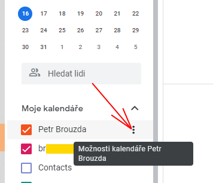
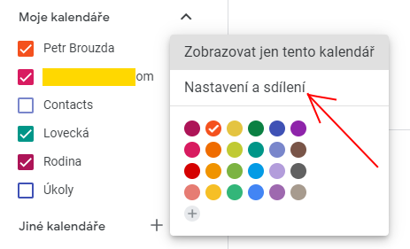

# IcalTransformer

Načte ICAL verzi Google kalendáře a vrátí události v zadaném časovém okně ve formě jednoduchého JSON dokumentu.
Vyzkoušejte si přes **přehledný testovací formulář** na adrese https://lovecka.info/IcalTransformer/

Je určeno např. pro zobrazení kalendáře na displejích meteostanic se slabým procesorem.

Stahované ICAL kalendáře si kešuje - nestahuje je častěji než jednou za hodinu, i když přijde požadavek častěji. 
Stejně tak si kešuje i další zpracování dokumentu. 
I pokud budete zasílat požadavky opakovaně častěji, k výpočtům dojde jen jednou za hodinu.

---
# Volání a parametry

Stránka pro podání JSON dat sedí na adrese https://vas-server/IcalTransformer/ical/data
(možno vyzkoušet na https://lovecka.info/IcalTransformer/ical/data )
a bere následující GET parametry:

*  **url** - URL ICAL kalendáře; může být více adres oddělených znakem "pípa", tedy |. Musí bát URL-encoded!
*  **format** - "json" nebo "html"
*  **htmlAllowed** - "no" znamená, že v popisech události se ořežou HTML tagy; "yes" je tam nechá
*  **mode** - určení, které události se mají zobrazit. Buď "todayplus" nebo "daterange".

## mode=todayplus

Vrátí události od "teď" po několik dalších dní udaných parametrem **rangeDays** .
* rangeDays=0 .... vrátí od teď do dnešní půlnoci
* rangeDays=1 .... vrátí od teď do zítřejší půlnoci
* rangeDays=2 .... vrátí od teď do pozítřejší půlnoci

a tak dále (hodnota není omezena).

## mode=daterange

Očekává dva parametry:
* **from** - datum, od kterého má vracet události, YYYY-MM-DD. Události v tomto dni budou zahrnuty do výstupu.
* **to** - datum, do kterého má vracet události, YYYY-MM-DD. Události v tomto dni už nebudou zahrnuty do výstupu.


## Ukázka volání

Celé URL může vypadat třeba takto (privátní části odkazu jsou nahrazeny, takže URL není funkční):

```
https://lovecka.info/IcalTransformer/ical/data?url=https%3A%2F%2Fcalendar.google.com%2Fcalendar%2Fical%2FXXX.XXXXXX%2540gmail.com%2Fprivate-6ZZZZZZZZZZZZZ%2Fbasic.ics&rangeDays=2&format=json&htmlAllowed=no&mode=todayplus
```

---
# Jak získat URL na ICAL soubor Google Kalendáře?

Otevřete si svůj Google kalendář.

Na levé straně pod měsíčním kalendářem a hledacím polem je seznam zobrazených kalendářů. Klikněte na trojtečku u kalendáře:



Zvolte "Nastavení a sdílení":



Najděte položku "Tajná adresa ve formátu iCal" a klikněte na ikonu kopírování u ní.


Pokud tam tuto možnost nemáte (je tam jen "veřejná adresa"), nejste přímým vlastníkem kalendáře - typicky u firemních/školních účtů.


---
# Popis instalace

Potřebujete:

* webový server s podporou pro přepisování URL – tedy pro Apache httpd je potřeba zapnutý **mod_rewrite**
* rozumnou verzi PHP (nyní mám v provozu na 7.2)

Instalační kroky:

1) Stáhněte si celou serverovou aplikaci z githubu.

2) V adresáři vašeho webového serveru (nejčastěji něco jako /var/www/) udělejte adresář pro aplikaci, třeba "IcalTransformer". Bude tedy existovat adresář /var/www/IcalTransformer přístupný zvenčí jako https://vas-server/IcalTransformer/ .

3) V konfiguraci webserveru (zde předpokládám Apache) povolte použití vlastních souborů .htaccess v adresářích aplikace – v nastavení /etc/apache2/sites-available/vaše-site.conf pro konkrétní adresář povolte AllowOverride

Tj. pro konfiguraci ve stylu Apache 2.2:
```
<Directory /var/www/IcalTransformer/>
        AllowOverride all
        Order allow,deny
        allow from all
</Directory>
```
a ekvivalentně pro Apache 2.4:
```
<Directory /var/www/IcalTransformer/>
        AllowOverride all
        Require all granted
</Directory>
```


4) Nakopírujte obsah podadresáře aplikace/ do vytvořeného adresáře; vznikne tedy /var/www/IcalTransformer/app ; /var/www/IcalTransformer/data; ...

5) Přidělte webové aplikaci právo zapisovat do adresářů log a temp! Bez toho nebude nic fungovat. Nejčastěji by mělo stačit udělat v /var/www/IcalTransformer/ něco jako:

```
sudo chown www-data:www-data log temp
sudo chmod u+rwx log temp
```

8) No a nyní zkuste v prohlížeči zadat https://vas-server/IcalTransformer/  a měli byste dostat testovací stránku.

9) Pokud něco selže, čtěte soubor exception-*.html  v adresáři log/ 


## Řešení problémů, ladění a úpravy

Aplikace je napsaná v Nette frameworku. Pokud Nette neznáte, **důležitá informace**: Při úpravách aplikace či nasazování nové verze je třeba **smazat adresář temp/cache/** (tedy v návodu výše /var/www/IcalTransformer/temp/cache). V tomto adresáři si Nette ukládá předkompilované šablony, mapování databázové struktury atd. Smazáním adresáře vynutíte novou kompilaci.

Aplikace **loguje** do adresáře log/ do souboru app.YYYY-MM-DD.txt . Defaultně zapisuje základní informace o provozu; úroveň logování je možné změnit v app/Services/Logger.php v položce LOG_LEVEL.

Konfigurace aplikace je v app/Services/Config.php

Aplikace může být dle nastavení vašeho webserveru dostupná přes https nebo přes http (je jí to jedno).
